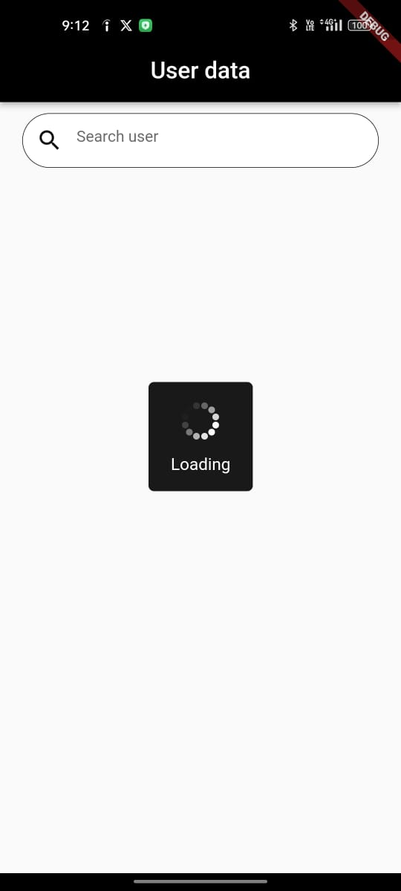
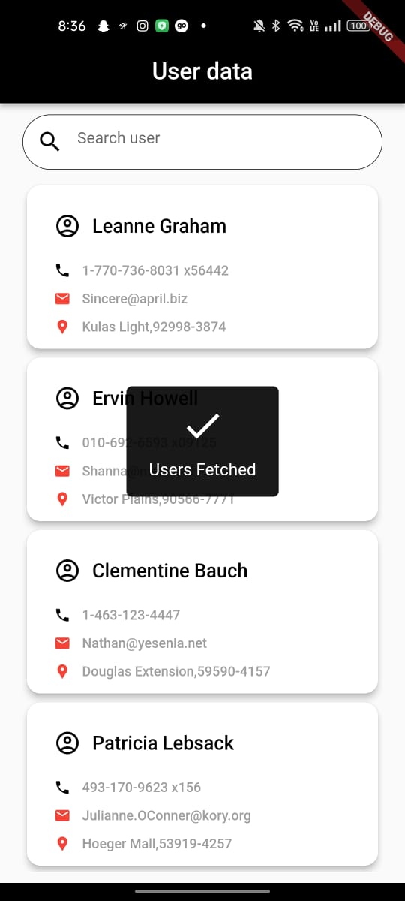
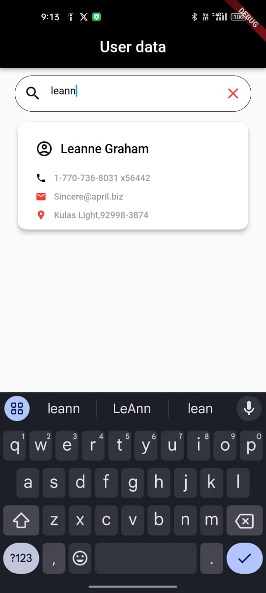
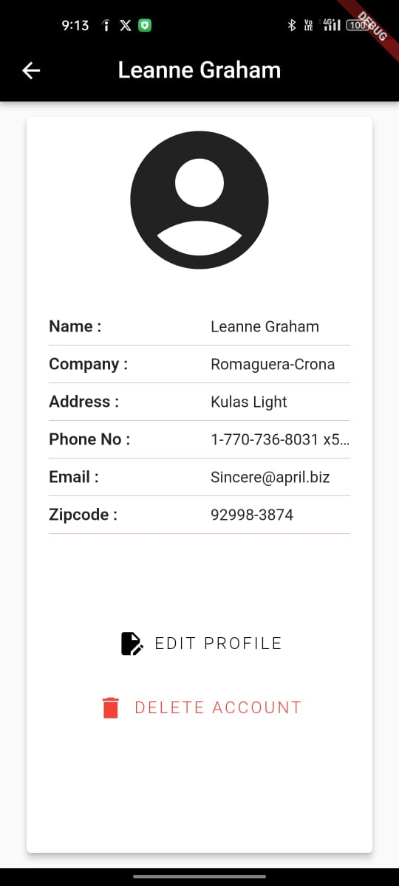

# User Data - Flutter App

User Data is a Flutter app that fetches and displays a list of users and their details from the JSONPlaceholder API. The app uses a Data UI and Network approach to fetch and display data. It incorporates Provider for state management and http for making API calls with custom exception handling.

# Features

. Fetches user data from JSONPlaceholder API.
. Local search functionality to filter users by name.
. Provider for state management.
. API calls with the http package.
. Custom exception handling for network errors.

# Installation

1. Clone the repository:

git clone https://github.com/yourusername/user_data.git
cd user_data

2. Install dependencies:

flutter pub get
Run the app: flutter run

# Key Components

Data UI Approach: Displays fetched user data in a clean, user-friendly interface.
Network Approach: Fetches data from the public JSONPlaceholder API.
Provider: Used for state management to handle loading states, user data, and errors.

# Screenshots

